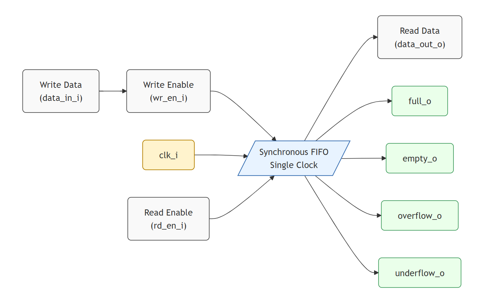
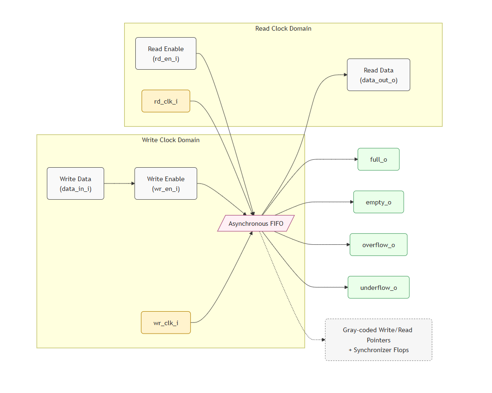
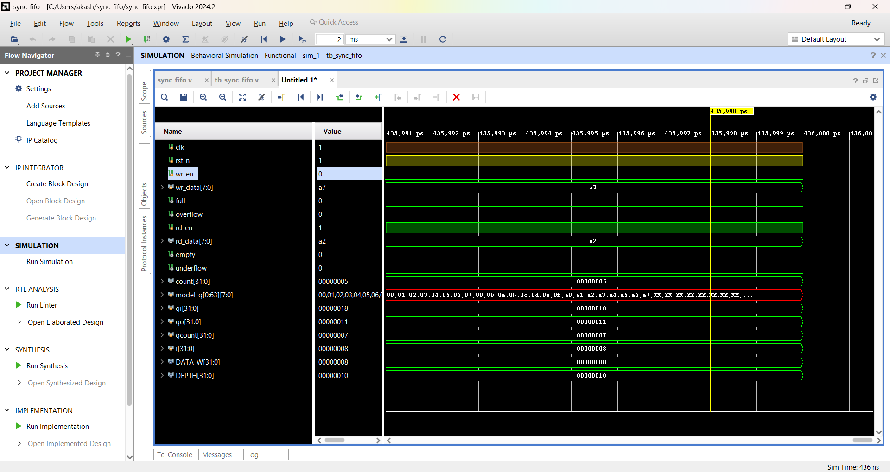
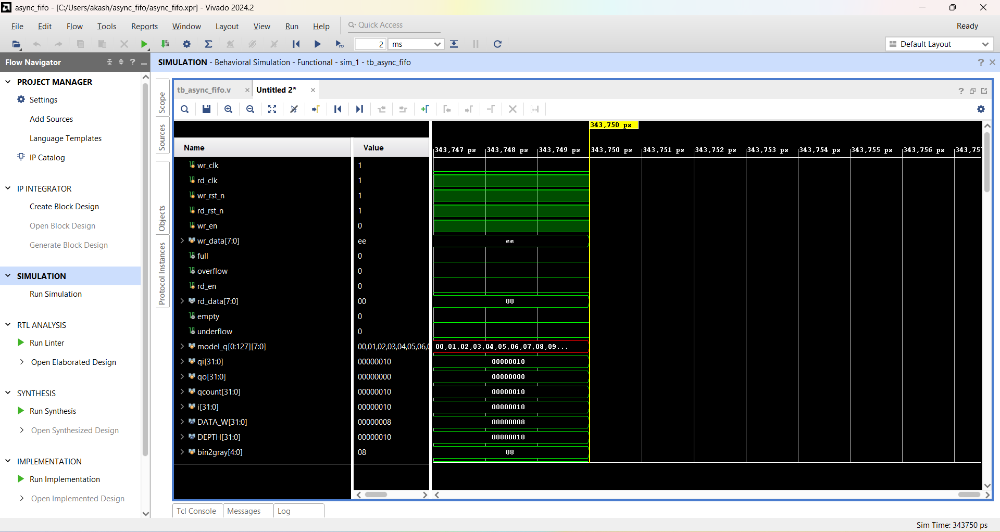
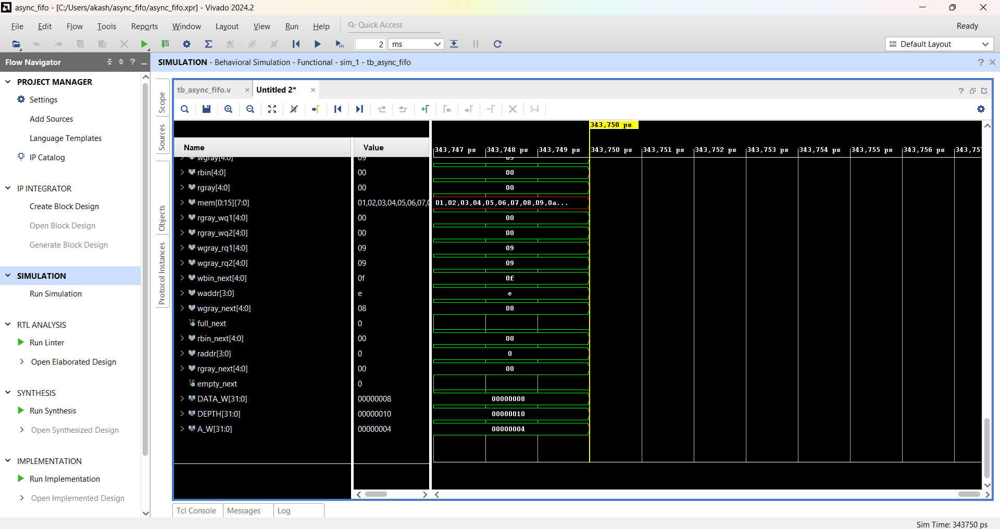
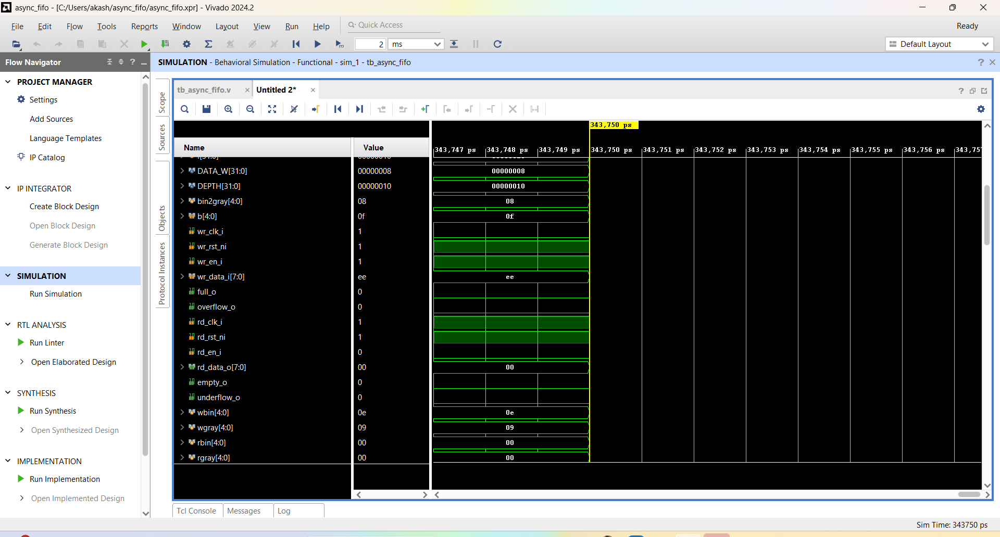
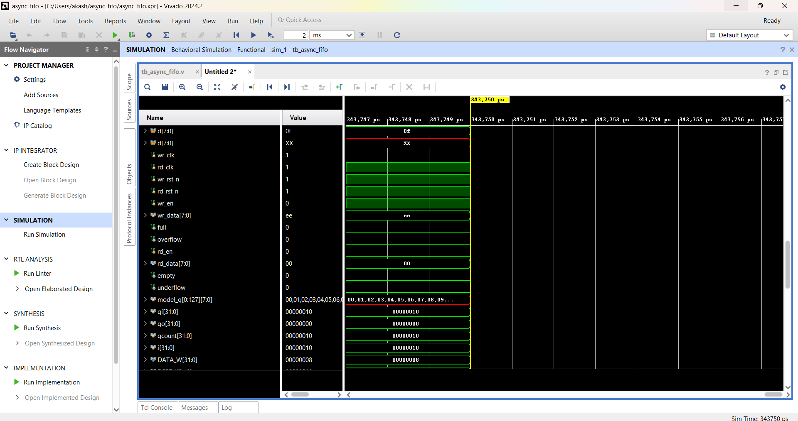

# -Standalone-FIFO-IP-Core-Design-
<h1>FIFO IPs with Verification</h1>

  This project implements <b>standalone FIFO (First-In-First-Out) IP cores</b> that are
  commonly used in digital systems for buffering and reliable data transfer between components.
  Two variants are included:

<ul>
  <li><b>Synchronous FIFO</b> – operates on a single clock domain, suitable for systems where read and write operations share the same clock.</li>
  <li><b>Asynchronous FIFO</b> – operates across two different clock domains (dual-clock), using Gray-coded pointers and synchronizers to ensure safe data transfer without metastability.</li>
</ul>

  Both designs include standard features such as <b>full</b> and <b>empty</b> flag logic, as well as
  detection of <b>overflow</b> and <b>underflow</b> conditions. The FIFOs are designed to be <b>parameterizable</b>
  in terms of data width and depth, making them flexible for integration into larger FPGA or ASIC projects.

  To validate the design, a comprehensive <b>Verilog Verification Environment</b> has been created.
  It uses <b>constrained-random stimulus</b>, <b>scoreboard-based checking</b>, <b>protocol assertions</b>,
  and <b>functional coverage</b> to ensure correctness across a wide range of scenarios, including
  corner cases such as underflow, overflow, and simultaneous read/write operations. The asynchronous
  FIFO verification also includes coverage for clock-domain crossing behavior.

<h2>✨ Features</h2>
<ul>
  <li><b>Synchronous FIFO</b> (single clock)</li>
  <li><b>Asynchronous FIFO</b> (dual clock, Gray-coded pointers, two-flop synchronizers)</li>
  <li>Full / Empty flag logic</li>
  <li>Overflow / Underflow detection</li>
  <li>Parameterizable data width and depth</li>
  <li>Optional valid/ready-style streaming interface</li>
  <li><b>Verification</b>
    <ul>
      <li>Constrained-random stimulus</li>
      <li>Scoreboard-based checking</li>
      <li>Protocol assertions (no write when full, no read when empty)</li>
      <li>Corner-case coverage: underflow, overflow, simultaneous read/write</li>
    </ul>
  </li>
</ul>

🏗️ Synchronous FIFO Block Diagram

  

 🏗️ Asynchronous FIFO Block Diagram

  

<h2>⚙️ Parameters</h2>
<table>
  <tr>
    <th>Parameter</th>
    <th>Default</th>
    <th>Description</th>
  </tr>
  <tr>
    <td>DATA_WIDTH</td>
    <td>8</td>
    <td>FIFO data width</td>
  </tr>
  <tr>
    <td>DEPTH</td>
    <td>16</td>
    <td>Number of entries (must be power-of-two for typical implementations)</td>
  </tr>
  <tr>
    <td>ADDR_WIDTH</td>
    <td>4</td>
    <td><code>$clog2(DEPTH)</code> (used for pointers)</td>
  </tr>
  <tr>
    <td>ASYNC_MODE</td>
    <td>0</td>
    <td>0 = Synchronous FIFO; 1 = Asynchronous FIFO</td>
  </tr>
</table>

<h2>🔌 Interfaces</h2>

<h3>Common Signals</h3>
<ul>
  <li><b>rst_ni</b> – Active-low reset</li>
  <li><b>data_in_i[DATA_WIDTH-1:0]</b> – Write data</li>
  <li><b>data_out_o[DATA_WIDTH-1:0]</b> – Read data</li>
  <li><b>wr_en_i</b> – Write enable</li>
  <li><b>rd_en_i</b> – Read enable</li>
  <li><b>full_o</b>, <b>empty_o</b> – Status flags</li>
  <li><b>overflow_o</b>, <b>underflow_o</b> – Error flags (assert on illegal ops)</li>
</ul>

<h3>Synchronous FIFO (single clock)</h3>
<ul>
  <li><b>clk_i</b> – Single clock domain for read and write</li>
</ul>

<h3>Asynchronous FIFO (dual clock)</h3>
<ul>
  <li><b>wr_clk_i</b> – Write clock domain</li>
  <li><b>rd_clk_i</b> – Read clock domain</li>
  <li>Gray-coded write/read pointers + two-flop synchronizers for CDC</li>
</ul>

<h2>🚀 Getting Started</h2>

<h3>Clone</h3>
<pre><code>git clone https://github.com/&lt;your-username&gt;/fifo-ip-with-verification.git
cd fifo-ip-with-verification
</code></pre>

<h3>Lint (Verilator)</h3>
<pre><code>verilator --lint-only -Wall -Irtl -Isim -f sim/filelist.f
</code></pre>

<h3>Run Tests</h3>

<b>Verilator</b>

<pre><code>make verilator TEST=smoke_test
</code></pre>

<b>Icarus Verilog</b>

<pre><code>make icarus TEST=random_stimulus_test
</code></pre>

<b>Questa/ModelSim</b>

<pre><code>vsim -c -do scripts/run_questa.tcl
</code></pre>

<h2>🧪 Output_Synchronous_FIFO</h2>
<ul>

  

<h2>🧪 Output_Synchronous_FIFO</h2>
<ul>

  

  

  

  

  
<h2>🧪 Verification</h2>
<ul>
  <li><b>Stimulus</b>: Constrained-random sequences for write/read operations with bursts and idle gaps</li>
  <li><b>Scoreboard</b>: Mirrors expected FIFO behavior (golden model) and compares against DUT</li>
  <li><b>Assertions</b>:
    <ul>
      <li>No write when <code>full_o</code> (except tests that explicitly provoke overflow)</li>
      <li>No read when <code>empty_o</code> (except tests that explicitly provoke underflow)</li>
      <li>Pointer and flag consistency checks</li>
    </ul>
  </li>
  <li><b>Functional Coverage</b>:
    <ul>
      <li>Depth bins (empty, almost-empty, mid, almost-full, full)</li>
      <li>Simultaneous read/write cases</li>
      <li>Underflow and overflow events</li>
      <li>CDC scenarios for asynchronous FIFO (phase offsets, frequency ratios)</li>
    </ul>
  </li>
</ul>

<h2>📊 Example Results</h2>
<ul>
  <li>✅ Smoke test passes for both synchronous and asynchronous FIFOs</li>
  <li>✅ Underflow and overflow detected with correct flag behavior</li>
  <li>✅ Simultaneous read/write exercised with expected data ordering</li>
  <li>✅ Async FIFO verified for Gray-coded pointer crossing and metastability mitigation</li>
</ul>

<h2>💼 Resume Snippet</h2>

  <i>
  FIFO IPs with Verification — Designed Synchronous FIFO (single clock) and Asynchronous FIFO (dual clock, Gray-coded pointers with synchronizers);
  built Verilog VIP with constrained-random tests, scoreboard, protocol assertions, and coverage for underflow, overflow, and simultaneous read/write.
  </i>

